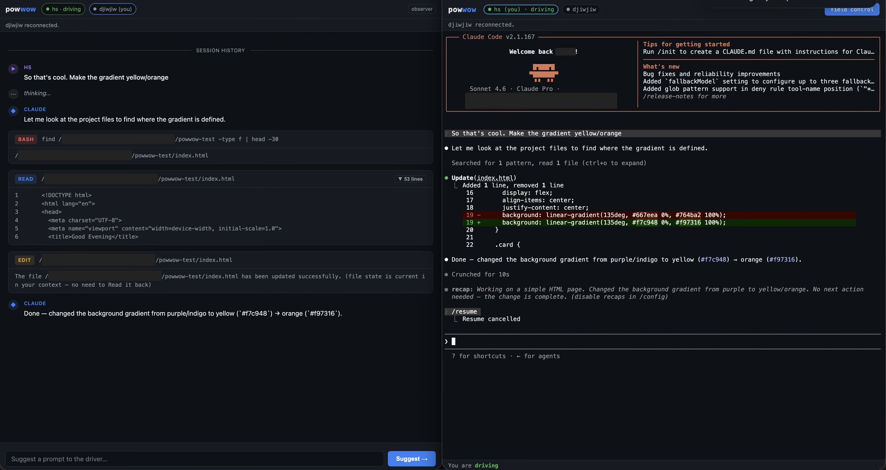

# powwow



Share a live agentic coding session with your team. The driver works in a full
terminal; teammates join a purpose-built observer view that shows a structured
activity feed — user messages, Claude's responses, and expandable tool cards —
instead of a raw terminal scroll.

The daemon wraps a command (default `bash`, or `claude` for a Claude Code
session) in a PTY it fully owns, and relays everything to any number of browsers
over WebSocket. Local-first: no VPS, no tmux, no sync layer. Everything runs on
your machine and is reachable on your LAN.

```
Driver (terminal view /  )  ─┐
Observer A (/observe)        ─┼── WebSocket ──▶  powwow daemon  ──PTY──▶  claude / bash / …
Observer B (/observe)        ─┘       │                │
                               turn-taking +     agent event
                               presence          adapter (JSONL)
```

## Quick start

```bash
npm install      # builds node-pty natively; needs a C/C++ toolchain + python3
npm run build
node dist/cli.js start
```

You'll get two sets of links:

```
  powwow session is live
  wrapping: bash

  Host (terminal view):
    this machine   http://localhost:4321/?t=<token>
    on your LAN    http://192.168.1.23:4321/?t=<token>

  Teammates (observer view):
    this machine   http://localhost:4321/observe?t=<token>
    on your LAN    http://192.168.1.23:4321/observe?t=<token>
```

The driver opens the **Host** link — a full xterm.js terminal with turn-taking
controls. Teammates open the **Teammates** link — an activity feed that shows
what Claude is doing in a readable, structured form.

To wrap a Claude Code session instead of bash:

```bash
node dist/cli.js start --cmd "claude"
```

(Requires Claude Code installed and authenticated. The daemon spawns whatever
command you pass to `--cmd` — auth is handled by Claude itself.)

### CLI options

| Flag | Default | Meaning |
|---|---|---|
| `--cmd "<command>"` | `bash` | Command to wrap, e.g. `--cmd "claude"` |
| `--port <n>` | `4321` | Port to listen on |
| `--host <addr>` | `0.0.0.0` | Bind address (LAN-reachable by default) |
| `--cwd <dir>` | current dir | Working directory for the wrapped command |
| `--claude-config-dir <dir>` | `~/.claude` | Override the Claude config directory if you use a non-default location |

## What works today

**Host view** (`/`)
- Full shared terminal (xterm.js) with live PTY output.
- Turn-taking: exactly one driver at a time. The first to join drives; others can **Request control** and queue up. Driver hits **Yield control** to hand over.
- **Suggestion queue** — observers type a prompt and hit Suggest; the driver sees it in a tray and can send it to Claude or dismiss it.
- **Typing indicators** — animated dots when the driver is typing to Claude or an observer is composing a suggestion.
- Late joiners get terminal scrollback replayed immediately.

**Observer view** (`/observe`) — Claude sessions only
- Structured activity feed: user messages, Claude text responses, and tool call cards (Bash, Read, Write, Edit, and others), each colour-coded and expandable.
- Tool results with >6 lines show a line count and expand on click.
- Late joiners receive a full history replay with a "session history" separator.
- `/resume` aware: when the driver resumes a past Claude session, the observer feed replays that session's history automatically.

**Session log**
- `powwow log` — lists recorded sessions (participants, command, duration).
- `powwow log <n>` — shows the nth most recent session in detail.

## How it works

The daemon owns every byte in and out of the PTY. Output is broadcast to all
clients; input is forwarded **only** from the current driver. The observer feed
is driven by a separate adapter that watches Claude's own session JSONL files.

| Path | Responsibility |
|---|---|
| `src/cli.ts` | Arg parsing, token, link printing, `powwow log` |
| `src/daemon.ts` | PTY + HTTP + WebSocket relay; wires up the agent adapter |
| `src/session.ts` | Pure turn-taking + presence state machine (no I/O) |
| `src/agent-adapter.ts` | Watches Claude session JSONL, emits typed `AgentEvent`s |
| `src/protocol.ts` | WebSocket message types |
| `public/index.html` + `app.js` | Host terminal view |
| `public/observe.html` | Observer activity feed |
| `public/vendor/` | Bundled xterm.js + fit addon (no CDN) |

Full protocol and state machine details are in **`docs/ARCHITECTURE.md`**.

## Contributing / development

```bash
npm install        # builds node-pty; vendors already in public/vendor
npm run build      # tsc -> dist/
npm run dev        # run from source via tsx (no build step)
```

Tests:

```bash
npm run test:relay # headless: input gating + control handoff (no native deps)
npm run test:e2e   # same flow against a real bash PTY (needs node-pty built)
```

Conventions:

- Keep `src/session.ts` pure — no sockets, no PTY. All I/O stays in `daemon.ts`.
- Never trust the client for control: input/resize are gated server-side.
- Don't reintroduce a CDN dependency; vendor browser assets into `public/vendor/`.
- The PTY is injectable (`spawnPty` option) so tests never need native bindings.

## Scope / not yet

Auth is a single unguessable token in the share link — fine for local and
trusted-LAN use, **not** for exposing to the public internet. Internet
tunneling, multi-model observer adapters, and remote hosting are post-MVP;
see `docs/ROADMAP.md`.

## Troubleshooting

- **`posix_spawnp failed` on start (macOS):** node-pty's `spawn-helper` binary
  lost its execute bit. Run `chmod +x node_modules/node-pty/build/Release/spawn-helper`.
  A `postinstall` hook and a runtime check now fix this automatically on fresh installs.
- **Join button does nothing / blank terminal:** hard-refresh (Cmd-Shift-R). The
  terminal library is served locally from `/vendor/`; errors surface in the notice bar.
- **Observer feed empty after joining:** the adapter watches
  `~/.claude/projects/<slug>/` (or `--claude-config-dir` equivalent). Make sure
  `--cwd` matches the directory you run Claude in.
- **`npm install` complains about an existing `node_modules`:** delete it and reinstall.

## Docs

- `docs/DIRECTION.md` — what the tool is for and where it's headed
- `docs/ARCHITECTURE.md` — components, WebSocket protocol, state machine, adapter seam
- `docs/ROADMAP.md` — status, next steps, open design questions
- `CLAUDE.md` — orientation for working on this repo with Claude Code
